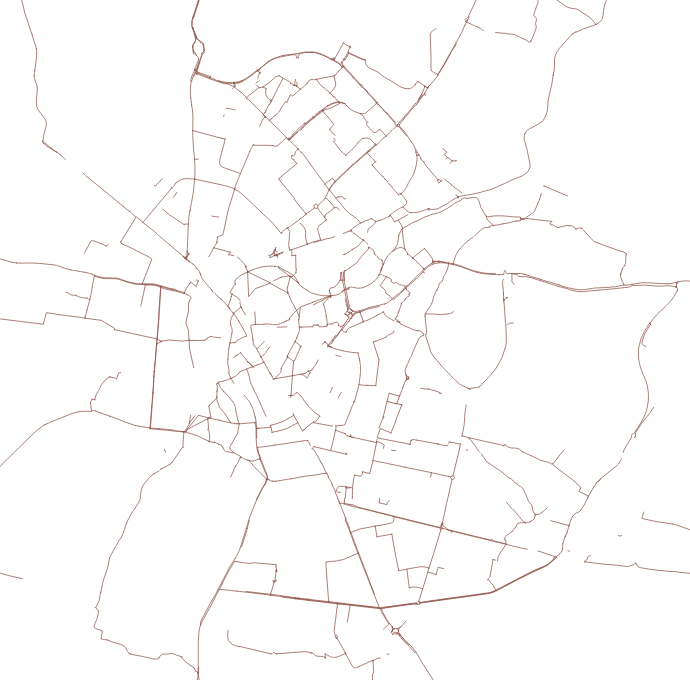

# DfT England Cycling Data 2011

This repository contains a version of the cycling data released by the UK's Department for Transport in 2011.

It is an **OpenStreetMap-orientated version** of the [data published on data.gov.uk](https://data.gov.uk/dataset/cycle-routes). As such it is subject to OSM licensing conditions.

For almost all uses, CycleStreets instead strongly recommends [downloading](https://wiki.openstreetmap.org/wiki/Downloading_data) data from [OpenStreetMap](https://www.openstreetmap.org/), which is topographically routable and is maintained and has far greater geographical coverage. However, the data in this repo contains attributes on each geometry which remain often more detailed than OSM. Accordingly, the data is most useful for **research purposes** and for **manual merging into OSM**, which is encouraged.

The original data.gov.uk data, from which this repository is derived, is described as follows:

"A digital geographical description of the cycle path network that was created for the Transport Direct cycle journey planner. The data describes the cycle route geometry and a variety of features on cycle paths and roads, such as the presence of cycle lanes and toucan crossings. The road data is referenced to the Ordnance Survey digital road network and doesn't include road geometry. The data is free and is made available under the Open Government Licence. THIS DATASET IS NO LONGER UPDATED."

This version of the data has been snapped to OSM geometries (as of 2011) and the attributes converted to OSM norms.

The data includes cycle routes, surface types, widths of cycle lanes, presence of lighting, cycle parking, and so on. The [CycleStreets](https://www.cyclestreets.net/) routing engine (used for CycleStreets & various apps) [takes these into account](https://www.cyclestreets.net/blog/2012/05/20/more-osm-tags-supported/).

# Licensing and copyright

The [original data](https://data.gov.uk/dataset/cycle-routes) was released under the Open Government Licence (OGL).

The version in this repository includes derivations from OpenStreetMap (OSM) geometries, dated 2011. Accordingly, the data contains intellectual property released under the Creative Commons CC-BY-SA 2.0 which **must** be attributed to OpenStreetMap.

Note that the alignment of the data to OSM in 2011 was done before the OSM license was changed to the ODBL, and thus is CC-BY-SA -licensed.

Suggested attribution:

"**UK Department for Transport data released under the Open Government Licence (OGL) additionally with data derived from OpenStreetMap licensed under the Creative Commons Attribution-ShareAlike 2.0 license, OpenStreetMap and contributors, 2011.**"

# History, collection and conversion

The data was originally collected for the DfT's [Transport Direct](https://en.wikipedia.org/wiki/Transport_Direct_Portal) project (which has since ceased operation), in order to add a cycle journey planner feature within it. Transport Direct was an early attempt to create an online multi-modal journey planner, and was, at the time of its launch, world-leading.

The cycling data was collected via on-street surveying undertaken by the DfT's contractor CycleCity Guides. The DfT's original intention was that TD would include data from both surveyed sources as well as data to be contributed by local cyclists. For various reasons, the latter did not happen.

The overall cost of the project was £2.4m, broken down roughly as £1.4m for data collection and £1m for software development and project management. Transport Direct was launched on the same day (March 20th, 2009) as CycleStreets, who had spent considerably less, which attracted some [criticism](http://www.rtaylor.co.uk/transportdirect-cyclestreets.html) as a result of an [FoI request](https://www.whatdotheyknow.com/request/transport_direct_cycle_journey_p).

In order to ensure that taxpayer value for this dataset was not lost, CycleStreets successfully encouraged the DfT to release the data openly and to do so in a way which would encourage use in OpenStreetMap. Accordingly, the DfT allocated a budget to convert the data to OSM standards, to help ensure much wider uptake.

The files here were thus converted by CCG (with CycleStreets subcontracting), as a contractor of the Department for Transport, to convert the Ordnance Survey -aligned data release to data in a format that could be more easily merged in to OpenStreetMap.

A GIS process was developed by CCG to snap the OS Open Data geometries to OSM geometries. An estimated >95% success rate was achieved, which is a testament to the excellent and painstaking work done by CCG. Properties were also converted to OSM tags, prefixed with ccg_.

This finalised data was then made available to the OpenStreetMap project, so that it could be merged in by process of manual inspection, by means of a tool created for the OSM [England Cycling Data project](https://wiki.openstreetmap.org/wiki/England_Cycling_Data_project), commissioned by CycleStreets.

The files in the present repository have had further conversion work undertaken in 2017 by CycleStreets, to merge them together into a single GeoJSON file with standard OSM tags, and the ccg_prefix removed.

Thanks are also due to Andy Allan, from whose [Snapshot Server](https://wiki.openstreetmap.org/wiki/Snapshot_Server) installation the current files have been retrived.

# Coverage extent and limitations

The TD data collection exercise covered all urban areas in England (i.e. not including Wales, Scotland, NI) with a population of >30,000 people, plus the Sustrans NCN (again, in England only).

Each urban area covers the signed cycle network. Accordingly, streets with cycle infrastructure that were not part of the signed network are not ordinarily present.

Essentially, therefore, the line coverage are equivalent to those on OpenStreetMap as shown as the [thick blue and red lines on OpenCycleMap](https://www.openstreetmap.org/#map=7/52.716/-1.203&layers=C).

The data was collected by area, as per the [coverage](coverage.geojson) file. Accordingly, where there are overlaps, data may be present twice.

The data is not intended as a strongly-connected graph, and as such routability is also not guaranteed.

Coverage:

Example area - Cambridge:

Notes: MLS, 18/Jan/2018.
